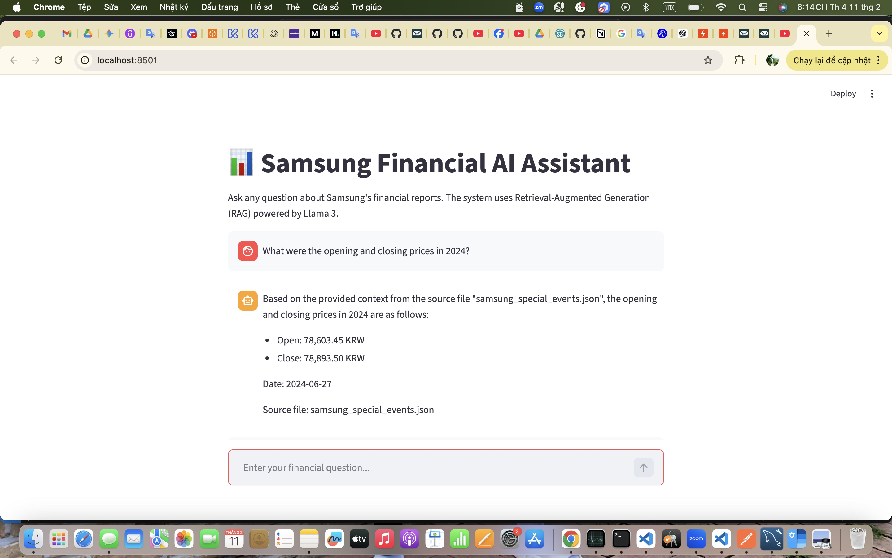

# 🏢 Internal RAG Chatbot – Financial-RAG-Assistan

**Financial-RAG-Assistan** is an internal **intelligent chatbot** project using **Retrieval-Augmented Generation (RAG)** to support searching, querying, and sharing internal financial information, illustrated for a fictitious company like Korea Study / Samsung.

The system combines **retrieval** and **generation**, ensuring AI answers are accurate based on actual data, cite sources, include numerical units, and avoid speculation.

---

## 🎯 Project Objectives
Developed an internal RAG Chatbot to automate financial data extraction, reducing manual search time and providing verifiable insights from consolidated financial statements.

* Implement an **internal chatbot** using RAG.
* Compare the effectiveness of **traditional keyword-based search** vs **semantic search (embedding + reranking)**.
* Deploy real-world models using tools: **Langchain, ChromaDB,...**.
* Ensure chatbot answers clearly, cite sources, include units, and use internal data only.

---

## 🛠️ Implementation Steps
### 0️⃣ Data Acquisition & Preprocessing

Fetch financial and stock data from Yahoo Finance (yfinance).

Process and clean raw data to generate structured JSON files:

samsung_special_events.json – contains special events affecting Samsung stocks.

hist_data_cleaned.json – historical financial and stock price data cleaned for analysis.

Handling PDFs in a financial context requires high precision to maintain the integrity of tables and balance sheets.

### 1️⃣ Basic Idea: Keyword Matching

* Search information based on traditional keywords.
* Use similar LLM to generate answers from search results. Noted:  API by Signup [https://groq.com](https://groq.com)
* Functions like a **rule-based chatbot**, serving as a baseline for comparison.
* Limitation: cannot detect deep semantic meaning, heavily dependent on exact keywords.

### 2️⃣ Upgrade with Vector Embedding

* Convert internal text into **numerical vectors** for semantic similarity search.
* User questions are also embedded into vectors.
* Retrieve the most semantically similar text segments.

### 3️⃣ Using Framework: Langchain

* Build **RAG pipeline**: retriever → reranker → LLM → output parser.
* Official site: [https://www.langchain.com](https://www.langchain.com)

### 4️⃣ Vector Store: ChromaDB

* Stores **vector embeddings**, metadata, and document chunks.
* Supports persistent storage and fast semantic search.
* Keeps source filenames in metadata for traceability.
* Official site: [https://www.trychroma.com](https://www.trychroma.com)

### 5️⃣ Optimizing RAG Performance with Ranking

* **Reranking** with **CrossEncoder (`ms-marco-MiniLM-L-6-v2`)** to rank the most relevant text.
* Take **top K** results after reranking for quality input to LLM.
* **Hybrid Search**: combines keyword search + semantic search for higher accuracy.

## 🔧 System Architecture

**Components:**

1. **RAG Pipeline (`rag_pipeline.py`)**

   * Retriever from ChromaDB
   * Reranker with CrossEncoder
   * Format documents 
   * LLM (ChatGroq)

2. **Backend API (`fastapi_server.py`)**

   * `/ask`: receive question, return answer from RAG pipeline
   * `/health`: server health check
   * Load pipeline **once on startup** for efficiency
   * Use `run_in_threadpool` to run synchronous pipeline in async context

3. **Frontend Web App (`app.py`)**

   * Streamlit interface for users
   * Calls backend API and displays answers with source filenames

---

## 📦 Libraries & APIs

**Python Packages:**

| Library               | Purpose                                       |
| --------------------- | --------------------------------------------- |
| langchain             | Build RAG pipeline, integrate LLM + retriever |
| Chroma                | Vector database for semantic search           |
| sentence_transformers | CrossEncoder reranker                         |
| pydantic              | Request/Response validation                   |
| streamlit / FastAPI   | Web frontend / API server                     |
| orjson                | Fast JSON parsing                             |

🖥️ System Demo Screenshot

